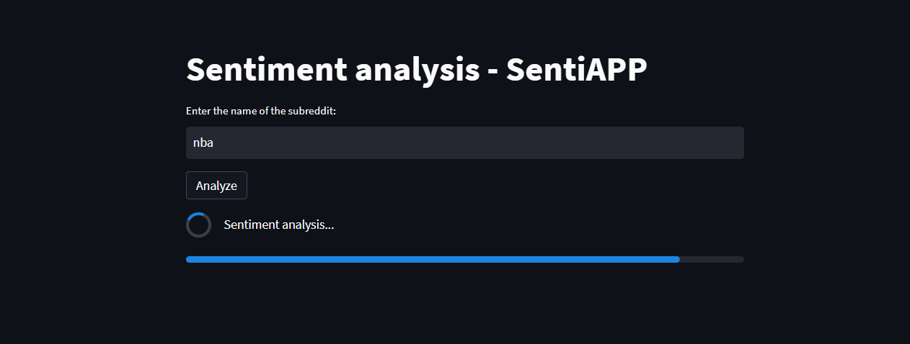
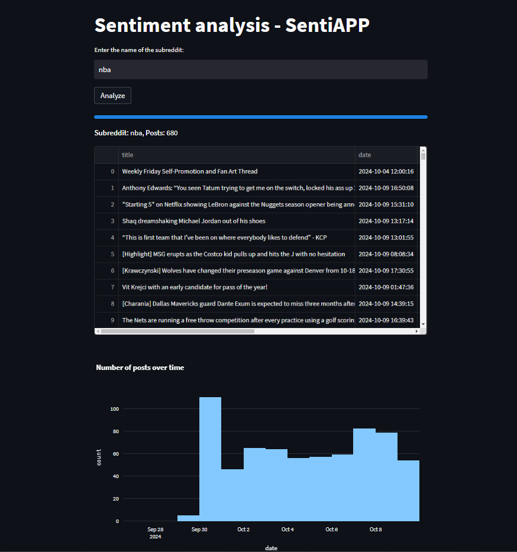
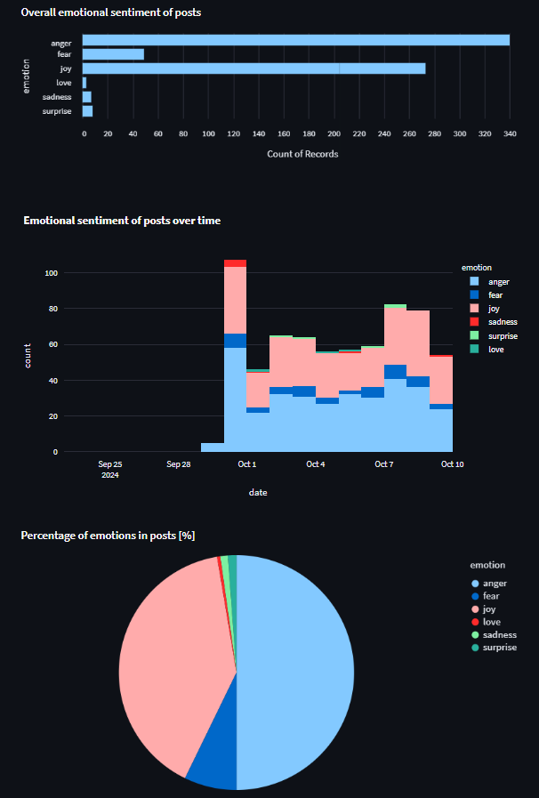

# SentiAPP 😄 🤖

SentiAPP analyzes Reddit posts from any subreddit specified by the user, performing sentiment analysis on the post titles using the Hugging Face Transformers `albert-base-v2-emotion` model. The results are displayed in various charts.



## Table of Contents
- [Features](#features)
- [Installation and run](#installation-and-run)
- [Docker Setup](#docker-setup)
- [Screenshots](#screenshots)

## Features 
- Fetches posts from Reddit using PRAW.
- Classifies the emotional sentiment of post titles (joy, anger, sadness).
- Displays the overall sentiment and sentiment trends over time using Plotly and Altair.
- Interactive Streamlit interface for user input and visualization.

## Installation and run

1. Clone the repository:
   ```bash
   git clone https://github.com/SentiAPP.git
   cd SentiAPP
   ```
2. Create and activate ``venv``.
3. Install the required dependencies:
    ```bash
    pip install -r requirements.txt
    ```
4. Set up your environment variables for Reddit API access. You can use a .env file or configure your environment variables manually:
    ```bash
    REDDIT_ID=<your_client_id>
    REDDIT_SECRET=<your_client_secret>
    REDDIT_USERNAME=<your_username>
    REDDIT_PASSWORD=<your_password>
    ```
5. When running the app using a ```venv```, make sure to uncomment the following lines in app.py to load environment variables from a .env file:
    ```bash
    # from dotenv import load_dotenv
    # load_dotenv()
    ```
6. Run the following command:
    ```bash
    streamlit run app.py
    ```
7. Open your web browser and go to ```http://localhost:8501```.

8. Enter the subreddit name and click Analyze to perform sentiment analysis on the latest posts.

## Docker Setup

To run the app using Docker, follow these steps:
1. Build the Docker image:
    ```bash
    docker compose up
    ```
2. Open the app in your browser at ```http://localhost:8501```.

## Screenshots



